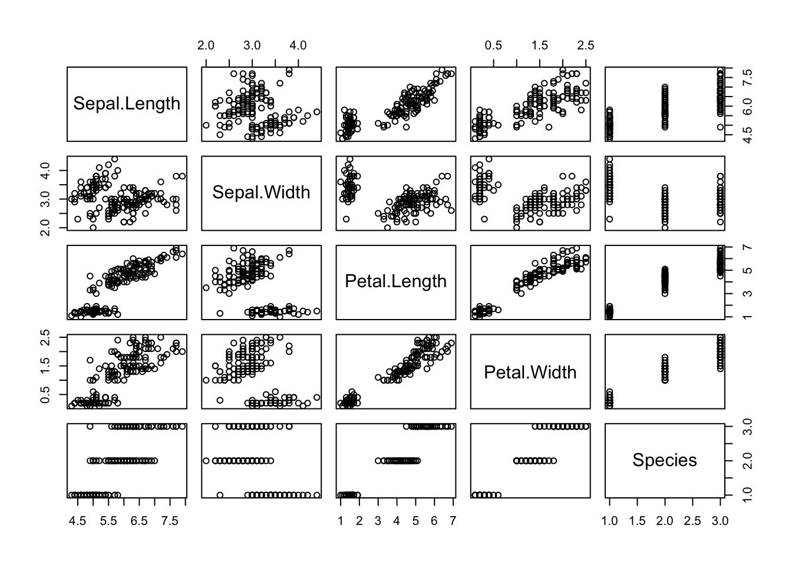

Programming Background
================
Aries Zhou
9/12/2021

## Backgrounds

In terms of advantages comparing to the other software, I think R is
very powerful and flexible since it contains a large range of functions
and new methods are easy to implement in the environment. R also has
extensive help resources and able to list all possible functions/options
when initial tokens are entered. However, it is relatively slower when
working on massive datasets, and many of its online functions resources
are not credible.

Other than R, I also like to use SAS. I miss the part that SAS usually
produced prettier outputs than R. The plots and outputs produced in R
are too plain that look like the style in decades ago.

I think R is a little harder to begin with, and due to its flexibility
in many aspects, there is always something new to explore and learn
about.

## Example R Markdown Output.

<!-- -->
